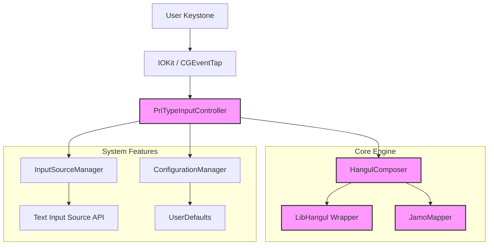

# PriType (프리타입)

**PriType**은 macOS를 위한 **현대적이고 강력한 Swift 기반 한글 입력기**입니다.  
기존 입력기들의 한계를 넘어, **완벽한 시스템 통합**과 **고성능 입력 경험**을 제공하기 위해 설계되었습니다.


---

## ✨ 왜 PriType인가요? (Why PriType?)

### 1. 완벽한 Finder 통합 (The "Ghost Window" Fix)
macOS 입력기들의 고질적인 문제인 **"Finder 바탕화면 플로팅 입력창"**을 근본적으로 해결했습니다.
- **스마트 좌표 감지:** Finder의 숨겨진 더미 입력창(`y < 50`)과 실제 검색창을 정밀하게 구분합니다.
- **해상도 독립성:** 5K, Retina, 250% 스케일링, 다중 모니터 등 어떤 환경에서도 오작동하지 않습니다.

### 2. 강력한 한글 엔진 (Powered by libhangul)
-검증된 `libhangul` 알고리즘을 Swift로 래핑하여 **정확하고 부드러운 한글 오토마타**를 제공합니다.
- **다양한 자판 지원:** 두벌식 표준, 세벌식 390, 두벌식/세벌식 옛한글 등을 모두 지원합니다.
- **모던 아키텍처:** 100% Swift 코드베이스로 작성되어(ObjC 브릿징 최소화), 가볍고 빠르며 안정적입니다.

### 3. 사용자 중심의 편의성
- **다양한 전환 단축키:** `Right Command` (한영키 대용) 및 `Ctrl + Space`를 지원하며, 설정에서 선택 가능합니다.
- **보안 입력 자동 감지:** 비밀번호 입력 시 자동으로 한글 조합을 중단하여 오입력과 비프음을 방지합니다.
- **스마트 텍스트:** 영어 문장 첫 글자 자동 대문자완성, 스페이스 두 번으로 마침표(`.`) 입력 등 모바일에서 경험하던 편리한 기능을 제공합니다.

### 4. 안전하고 투명한 보안
- **로깅 제로:** 릴리즈 빌드에서는 로깅 코드가 완전히 제거됩니다(`DebugLogger`). 키 입력 정보는 어디에도 저장되거나 전송되지 않습니다.
- **샌드박스 호환:** macOS App Sandbox 정책을 준수하여 시스템에 안전하게 설치됩니다.

---

## 🛠 아키텍처 (Architecture)

PriType은 유지보수성과 확장성을 위해 모듈화된 구조를 따릅니다.



### 주요 컴포넌트
- **`PriTypeCore`**: 입력기의 핵심 로직을 담은 프레임워크입니다.
    - **`PriTypeInputController`**: `IMKInputController`를 상속받은 메인 컨트롤러입니다. 이벤트 라우팅, Finder 감지, 모드 전환을 총괄합니다.
    - **`HangulComposer`**: 한글 조합 상태 머신입니다. 자소 결합/분해/수정 로직을 담당합니다.
    - **`RightCommandSuppressor`**: `CGEventTap`을 사용하여 `Right Command` 키를 한영 전환 전용으로 가로칩니다.
    - **`SettingsWindowController`**: 사용자 설정을 관리하는 UI 컨트롤러입니다.

---

## ⌨️ 지원 자판 (Supported Layouts)

설정 메뉴(`,` 단축키)에서 자판을 변경할 수 있습니다.

| ID | 자판 이름 | 설명 |
| :--- | :--- | :--- |
| `2` | **두벌식 표준** | 가장 널리 쓰이는 표준 자판 |
| `3` | **세벌식 390** | 기호 입력이 편리한 세벌식 자판 |
| `2y` | **두벌식 옛한글** | 제주어 및 고어 입력 지원 |
| `3y` | **세벌식 옛한글** | 세벌식 기반 옛한글 지원 |

---

## 🚀 설치 및 개발 가이드 (Installation & Development)

### 요구 사항
- macOS 13.0 (Ventura) 이상
- Xcode 14.0 이상 (Swift 5.10+)

### 빌드 및 설치 방법
터미널에서 제공되는 자동화 스크립트를 사용하세요.

```bash
# 1. 저장소 클론
git clone https://github.com/Meapri/PriType-Swift.git
cd PriType-Swift

# 2. 빌드 및 설치 (Release 모드)
# 이 스크립트는 빌드, 서명(로컬), 설치, 재시작을 한 번에 수행합니다.
./distribute.sh
```

### 테스트 실행
UI 테스트 대신 핵심 로직 검증을 위한 스크립트가 제공됩니다.

```bash
# 해상도 및 좌표 감지 로직 검증
./Tests/ResolutionTests.swift
```

---

## ❓ 문제 해결 (Troubleshooting)

**Q. 설치했는데 입력 메뉴에 안 보여요.**
A. 설치 후 로그아웃/로그인하거나 재부팅이 필요할 수 있습니다. 그 후 `시스템 설정 > 키보드 > 텍스트 입력 > 입력 소스 편집`에서 `PriType`을 추가해 주세요.

**Q. Finder 바탕화면에서 입력창이 안 떠요.**
A. **정상입니다!** PriType은 Finder 바탕화면과 같은 비(非) 텍스트 영역에서는 플로팅 입력창을 띄우지 않고 키 입력을 시스템으로 바로 넘깁니다(Pass-through). 이를 통해 파일 이름이 영어로 타이핑되며 네비게이션이 가능해집니다.

---

## 📝 라이선스 (License)

이 프로젝트는 **MIT License** 하에 배포됩니다. 자유롭게 수정하고 배포할 수 있습니다.
단, 내부적으로 사용된 `libhangul` 라이브러리는 해당 라이선스를 따릅니다.

Copyright © 2025 PriType Team.
