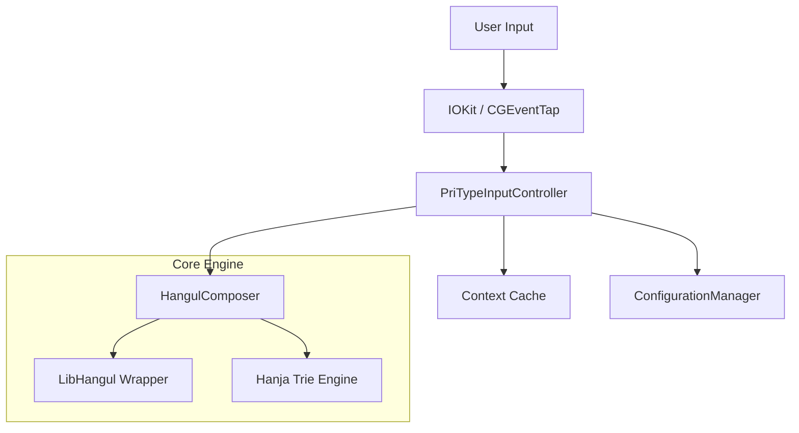

# PriType (프리타입)

macOS 통합형 **Swift 6 기반 한글 입력기**입니다.  
`InputMethodKit` 프레임워크를 사용하여 시스템과 매끄럽게 연동되며, 성능과 안정성에 초점을 맞췄습니다.


---

## ✨ 핵심 기능 및 기술 (Features & Technology)

### 1. 성능 최적화 (Performance)
- **Context Caching (Lazy Evaluation):** 매 키 입력마다 발생하던 무거운 IPC 호출(Finder 좌표 계산 등)을 최소화했습니다.
    - 입력창 활성화 시(`activateServer`) 컨텍스트를 1회 분석 후 캐싱하며, 비활성화 시(`deactivateServer`) 해제합니다.
    - "Hot Path"인 `handle(_:)` 메서드는 캐시된 값을 사용하여 **Zero-IPC**에 가까운 지연 시간을 보장합니다.

### 2. 정밀한 컨텍스트 감지 (Precise Context Detection)
- **Finder 통합:** `NSRunningApplication.current`를 통해 빠른 속도로 Finder를 감지합니다.
- **좌표 휴리스틱 (`y < 50`):** Finder 바탕화면의 더미 입력창 문제를 해결하기 위해 좌표 검사를 수행합니다.
    - **Safe Check:** 이 로직은 오직 Finder 앱 내부에서만 작동하도록 제한되어, 다른 앱(Safari, VSCode 등) 상단에서의 오작동을 원천 차단했습니다.
- **Pass-through Mode:** 비 텍스트 영역(바탕화면 등)에서는 입력을 가로채지 않고 시스템으로 바로 넘겨, 파일 이름 검색/네비게이션이 자연스럽게 동작합니다.

### 3. 강력한 한글 엔진 (Powered by libhangul-swift)
- **Trie 자료구조 기반 한자 엔진:** 기존 해시맵 방식 대신 Trie를 도입하여, 수만 단어의 한자 사전 검색(Prefix Match)을 **O(m)** 복잡도로 수행합니다.
- **Streaming Load:** 한자 사전 로딩 시 전체 파일을 메모리에 올리지 않고 스트리밍 방식으로 파싱하여 초기 메모리 점유율을 낮췄습니다. (상세 내용은 `libhangul-swift` 참조)

### 4. 배포 및 호환성 (Distribution)
- **Notarization Ready:** `xcrun notarytool`을 통한 애플 공증 프로세스가 자동화되어 있습니다.
- **Resource Bundle Fix:** Swift Package Manager의 리소스 번들 위치 문제를 해결(`checkResourceIsReachable` fallback)하여, 릴리즈 빌드에서도 로컬라이제이션이 정상 작동합니다.

---

## 🛠 아키텍처 (Architecture)



- **`PriTypeInputController`**: `IMKInputController` 서브클래스. 캐싱된 `ClientContext`를 기반으로 이벤트를 효율적으로 처리합니다.
- **`ClientContextDetector`**: 번들 ID 체크(Fast Path)와 좌표 휴리스틱(Conditional Path)을 결합한 하이브리드 감지 모듈입니다.
- **`RightCommandSuppressor`**: 로우 레벨 이벤트 탭을 통해 `Right Command` 키를 한영 전환 전용으로 매핑합니다.

---

## ⌨️ 지원 자판 (Layouts)

| ID | 이름 | 설명 |
| :--- | :--- | :--- |
| `2` | **두벌식 표준** | 표준 두벌식 (QWERTY 기반) |
| `3` | **세벌식 390** | 기호 입력이 강화된 세벌식 |
| `2y` | **두벌식 옛한글** | 제주어/고어 입력 지원 |
| `3y` | **세벌식 옛한글** | 세벌식 기반 옛한글 |

---

## 🚀 설치 및 개발 (Build & Install)

### 요구 사항
- macOS 14.0 (Sonoma) 이상
- Xcode 15.0 이상 (Swift 6.0)

### 자동 설치 (Recommended)
프로젝트 루트의 `distribute.sh` 스크립트를 사용합니다. 이 스크립트는 **Clean Build -> Code Signing -> Notarization -> Install -> Restart** 과정을 한 번에 수행합니다.

```bash
# 로컬 개발용 설치 (공증 건너뜀)
./distribute.sh

# 릴리즈용 설치 (공증 포함)
# 1. 앱 암호 생성 및 키체인 등록 필요 (xcrun notarytool store-credentials "PriTypeNotary")
NOTARIZE=true ./distribute.sh
```

### 디버깅
릴리즈 모드에서는 보안을 위해 `DebugLogger`가 비활성화(No-op)됩니다. 디버깅이 필요한 경우 Xcode에서 Debug 스키마로 빌드하세요.

---

## 📝 라이선스 (License)

**MIT License**
Copyright © 2025 PriType Team.
내부적으로 사용된 `libhangul-swift` 라이브러리는 해당 라이선스를 따릅니다.

